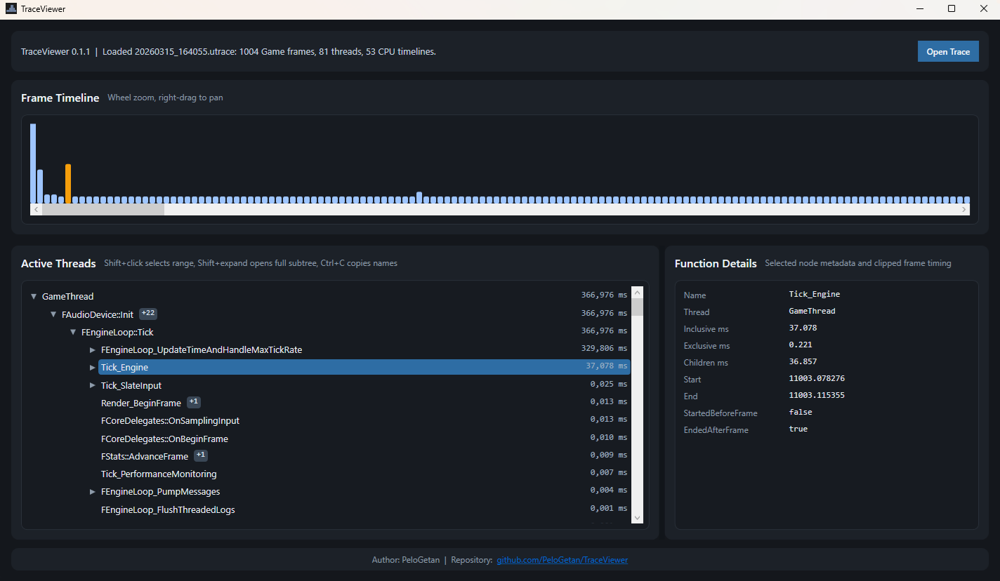

# TraceViewer

TraceViewer is a lightweight open source viewer for Unreal Engine `.utrace` captures.

This project was developed with AI assistance.

The current goal of the project is to provide a simpler and faster alternative to Unreal Insights for the classic Frontend Profiler workflow:

- frame timeline at the top;
- active CPU threads for the selected frame;
- call tree per thread;
- details pane for the selected scope.

At the moment the first public version is focused on **CPU profiling from local `.utrace` files**. The architecture is intentionally modular so GPU, networking, live connection, and other analysis modules can be added later.



## Current Features

- Open local Unreal Engine `.utrace` files
- Visualize Game frame timing in a zoomable frame timeline
- Show active CPU threads for the selected frame
- Build a per-thread call tree with inclusive and exclusive time
- Collapse long `1 -> 1 -> 1` chains for readability
- Display hidden chain names in the details pane
- Multi-select tree items with `Shift`
- Copy selected scope names with `Ctrl+C`

## Download

If you just want to use the program, download the latest ready-to-run build from **GitHub Releases**:

- [Releases](https://github.com/PeloGetan/TraceViewer/releases)

Each release includes a Windows `win-x64` build as a `.zip` archive.

## Run From Source

Requirements:

- Windows
- .NET 8 SDK

Build:

```powershell
dotnet build TraceViewer.sln
```

Run tests:

```powershell
dotnet test TraceViewer.sln --no-build
```

Start the app:

```powershell
dotnet run --project TraceViewer/TraceViewer.csproj
```

## Usage

1. Start TraceViewer.
2. Click `Open Trace`.
3. Select a local `.utrace` file.
4. Click a frame in the top timeline.
5. Inspect active threads and call trees in the lower panel.
6. Select a scope to view timing details on the right.

Tips:

- Mouse wheel: zoom frame timeline
- Right mouse drag: pan frame timeline
- `Shift+click`: select a range in the call tree
- `Shift+expand`: expand a whole subtree
- `Ctrl+C`: copy selected scope names

## Limitations

- First version is CPU-only
- Input is local `.utrace` only
- Internal function breakdown is available only when the trace contains nested CPU scopes
- Unreal trace coverage still depends on what was instrumented in the captured build

## Project Layout

- `TraceViewer/` - WPF application
- `TraceViewer.Tests/` - automated tests
- `UECode/` - Unreal Engine source references used for reverse engineering and validation
- `Docs/` - local research notes for the project

## Status

The project already provides a practical first-pass `.utrace` CPU viewer. Future work may include GPU support, live connection, and additional analysis modules.
